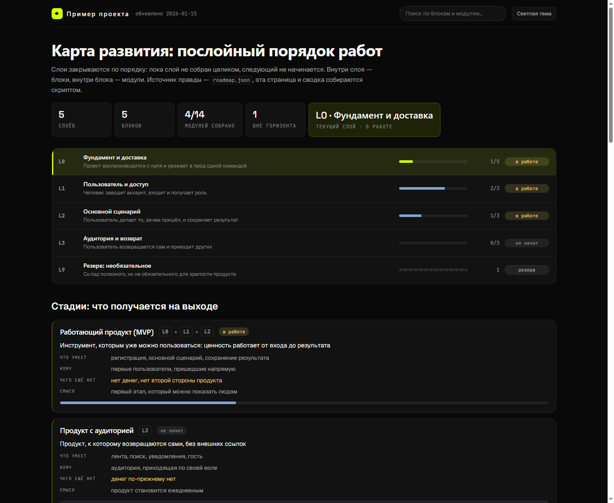

# layered-roadmap

**Скилл для ИИ-агентов: превращает проект, спеку и россыпь идей в карту развития, по которой видно, что делать дальше — и что уже сделано.**



Большие проекты обычно развиваются «от задачи к задаче»: работа разбросана по разным частям системы, к сделанному приходится возвращаться, а в прод всё уезжает кусками. Скилл наводит порядок: строит структуру, по которой идут **слой за слоем**, а релизят **блоками**, а не отдельными задачами.

Работает с любым стеком и в любом проекте: карта живёт в репозитории рядом с кодом, доска и сводка генерируются из единственного источника правды.

> AI-agent skill that turns a product spec and scattered ideas into a layered, staged development roadmap (JSON + interactive HTML + Markdown) with evidence-based statuses, a reserve bucket and a commit gate. Python 3.8+, no dependencies.

---

## Как это устроено

```
Слой (уровень зрелости)  →  Стадия (что за продукт получится)
Блок (единица релиза)    →  Модуль  →  Задача
```

| Понятие | Отвечает на вопрос | Пример |
|---|---|---|
| **Слой** | на чём это стоит | L0 фундамент и доставка · L1 пользователь и доступ · L2 основной сценарий · L3 аудитория |
| **Стадия** | что за продукт получится | S1 «работающий продукт» = L0+L1+L2 · S2 «продукт с аудиторией» = L3 |
| **Блок** | что поставляем целиком | «Лента и рекомендации», «Платежи и подписки» |
| **Модуль** | из чего состоит блок | ранжирование, обратная связь, журнал показов |

Слои закрываются по порядку: пока текущий не собран целиком, следующий не начинается. **Единица релиза — модуль или блок, никогда не задача.** Новая функциональность входит в карту блоком или модулем; работа без записи в карту считается незавершённой.

**Четыре вещи, которые отличают эту карту от обычного списка задач:**

1. **Статусы на доказательствах.** `не начат → в работе → собран → проверен → в проде`, и у всего, что выше «не начат», есть поле `evidence` — пути к файлам, миграции, тесты, тег релиза. Статус нельзя «нарисовать».
2. **Валидатор расхождений.** Скрипт считает статусы сам и падает, если блок заявлен «собран», а один из его модулей «не начат». Это ловит главную болезнь планов: «почти готово» на бумаге.
3. **Слой-резерв.** Полезное, но не критичное не выбрасывается и не тормозит слои — уходит в резерв с причиной и собирается разом одной волной, когда решишь.
4. **Ответ «что делать сегодня».** Одна команда печатает текущий слой, что уже в работе, следующий блок и что заблокировано.

---

## Что получается на выходе

| Артефакт | Что это | Кто читает |
|---|---|---|
| `docs/roadmap.json` | Единственный источник правды: слои, стадии, блоки, модули, статусы, зависимости, доказательства | агент и человек |
| `docs/ROADMAP.md` | Правила модели + автоматическая сводка, которая вставляется между маркерами | человек и агент |
| `ROADMAP.html` | Доска: прогресс слоёв, стадии, карточки блоков с модулями, поиск, фильтры по статусам и поверхностям, тёмная и светлая тема, список резерва | человек |

---

## Установка

**Любой агент (ZCode, Claude Code, Cursor, Cline).** Скопируйте папку `layered-roadmap/` в каталог скиллов своей среды и перезапустите её:

```bash
git clone https://github.com/Samiixo/layered-roadmap-skill.git
cp -r layered-roadmap-skill/layered-roadmap ~/.zcode/skills/     # ZCode
cp -r layered-roadmap-skill/layered-roadmap ~/.claude/skills/    # Claude Code
```

**Claude.ai и среды с импортом архивов.** Скачайте [`layered-roadmap.skill`](layered-roadmap.skill) из корня репозитория и загрузите как скилл.

**Без агента.** Скриптам нужен только Python 3.8+, зависимостей нет:

```bash
python3 layered-roadmap/scripts/build_roadmap.py layered-roadmap/assets/roadmap.example.json
```

---

## Быстрый старт

Первая сессия с агентом — просто попросите:

> «Построй карту развития по этому проекту»

Агент изучит код и документацию, разложит всё по слоям и стадиям, соберёт блоки и модули с критериями готовности, прогонит валидатор и выдаст три файла. Дальше картой пользуются так:

```bash
# что делать: текущий слой, работа в руках, следующий блок, блокировки
python3 scripts/build_roadmap.py docs/roadmap.json --next

# проверить карту (ловит расхождения статусов, битые зависимости, дубли id)
python3 scripts/build_roadmap.py docs/roadmap.json --check

# пересобрать доску и сводку
python3 scripts/build_roadmap.py docs/roadmap.json
```

Пример вывода `--next`:

```
СЛОЙ L0 · Фундамент и доставка — в работе
модулей собрано 9 из 46 (20%), блоков в проде 0 из 8

В РАБОТЕ (доводим до конца, не начиная нового):
  L0.B3 Данные и миграции — в работе
      · Бэкапы БД

СЛЕДУЮЩИЙ БЛОК: L0.B5 Мобильная доставка — пока ждёт L0.B2
Резерв: 34 позиции — не трогаем, пока слой не закрыт.
```

---

## Что просить у агента

| Задача | Как сформулировать |
|---|---|
| Построить карту с нуля | «Разложи проект по слоям и стадиям, начни с MVP» |
| Добавить функциональность | «Впиши в карту блок: подписки на авторов» |
| Обновить прогресс | «Авторизация готова, лента в работе — обнови статусы» |
| Закрыть слой | «Слой L0 закрыт, переходим к следующему» |
| Разобрать резерв | «Собери всё из резерва в одну волну» |

Скилл сам знает, куда что писать: новую работу — блоком в нужный слой, статусы — с доказательствами, резерв — одной волной, а не по одной позиции.

---

## Встроить карту в проект

Чтобы карта не устарела через месяц, нужны три вещи — готовые вставки лежат в `layered-roadmap/assets/templates/`:

1. **Правило в `AGENTS.md`** (или `CLAUDE.md`, `.cursor/rules`) — `AGENTS-snippet.md`.
2. **Раздел в `README.md`** и строка в каталоге документации — `README-snippet.md`.
3. **Гейт на коммит** — `pre-commit`:

```bash
mkdir -p .githooks
cp layered-roadmap/assets/templates/pre-commit .githooks/pre-commit
chmod +x .githooks/pre-commit
git config core.hooksPath .githooks
```

Хук срабатывает, только если в коммит попала карта, её сводка или генератор. Обойти разово — `git commit --no-verify`.

В том же файле — **блок-пометка для открывающего сообщения сессии**: он велит агенту начинать с `--next`, не брать работу вне текущего слоя и обновить карту перед финалом.

---

## Структура репозитория

```
layered-roadmap-skill/
├── layered-roadmap/                 # сам скилл — эту папку кладут в каталог скиллов
│   ├── SKILL.md                     # процесс: режимы работы, правила, запреты
│   ├── references/
│   │   ├── model.md                 # слои, стадии, статусы, свёртка, горизонты, резерв
│   │   ├── workflow.md              # релиз блока, закрытие слоя, ритм сессии, разбор резерва
│   │   ├── agent-files.md           # что и куда писать в агентских файлах
│   │   └── examples.md              # библиотека слоёв под типы проектов, шаблоны DoD
│   ├── scripts/
│   │   ├── build_roadmap.py         # доска, сводка, режимы --check и --next
│   │   └── pack.py                  # упаковка скилла в .skill
│   └── assets/
│       ├── roadmap.example.json     # рабочий пример карты
│       └── templates/               # вставки в AGENTS.md, README.md, сессию и git-хук
├── layered-roadmap.skill            # собранный пакет для загрузки одним файлом
└── docs/preview.png                 # скриншот доски
```

Пересобрать пакет после правок:

```bash
python3 layered-roadmap/scripts/pack.py layered-roadmap layered-roadmap.skill
```

---

## Чем отличается от предыдущей версии

Это вторая версия скилла: первая (`roadmap-architect`) строила карту и на этом останавливалась. Новая отличается тем, что её модель проверена на реальном проекте (67 блоков, 297 модулей):

| | roadmap-architect | layered-roadmap |
|---|---|---|
| Модель | матрица «слой × стадия», задача как единица | последовательные слои, стадии как их группы, модуль как единица |
| Статусы | статус можно поставить словами | только с доказательствами в `evidence` |
| Проверка | валидатор связей | валидатор + сверка заявленного статуса со свёрткой модулей |
| Необязательное | уходит «в мусор» или в later | явный слой-резерв с причиной, собирается волной |
| Повседневность | нет | `--next` на входе, гейт на коммите, вставки в агентские файлы |
| Зависимости | Python 3 | Python 3.8+, без пакетов |

---

## Лицензия

MIT — пользуйтесь, меняйте, делитесь с подписчиками. Файл [LICENSE](LICENSE).

## Обратная связь

Нашли баг или есть идея — открывайте Issue или присылайте Pull Request.
